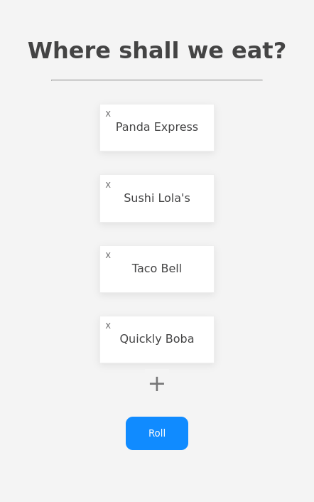

# roller
### make smart decisions

A simple dice roller to practice React.



Tap on an option to disable it. Tap the "x" to delete an option. Tap the "+" to add a new option. Tap on the title to change it.

### Install
```
git clone https://github.com/shintoo/Roller.git
cd Roller
npm install
npm start
```

### Dependencies
- npm
- react
- react-dom
